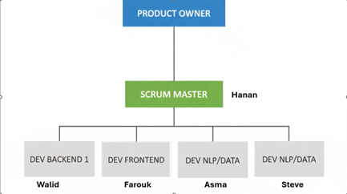
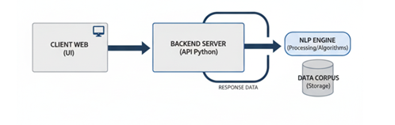

# Bibliothèque de Vectorisation de Texte

## Description du projet
L’objectif de ce travail pratique est d’implémenter une **bibliothèque de vectorisation de texte**.  
À terme, cette bibliothèque servira de base pour développer divers outils destinés à l’utilisateur final, tels que :  
- Résumé automatique de texte  
- Calcul de similarité  
- Détection de plagiat  
- … et autres fonctionnalités définies avec le Product Owner

Les fonctionnalités finales seront naturellement définies en collaboration avec le **Product Owner**.

---

## Membres du groupe
- **Hanane** (Scrum Master)  
- **Farah Mohamed Walid**
- **Blami Farouk Gnankambary**  
- **Asma Nihal Boukraa**  
- **M. Steve B. Sanogo**

## Organigramme de l'équipe

## Architecture de la solution

